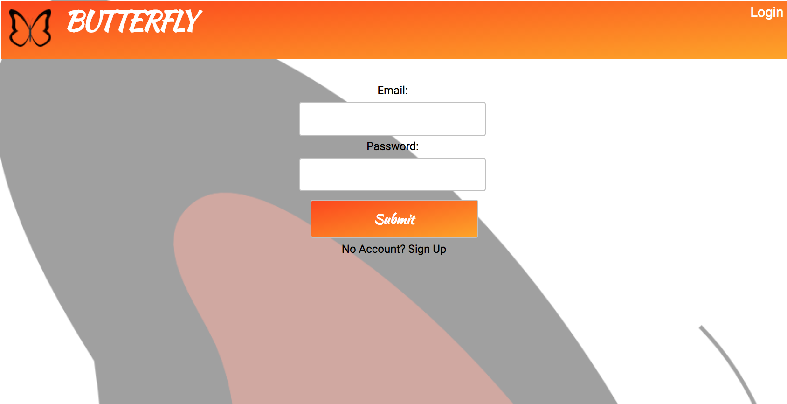
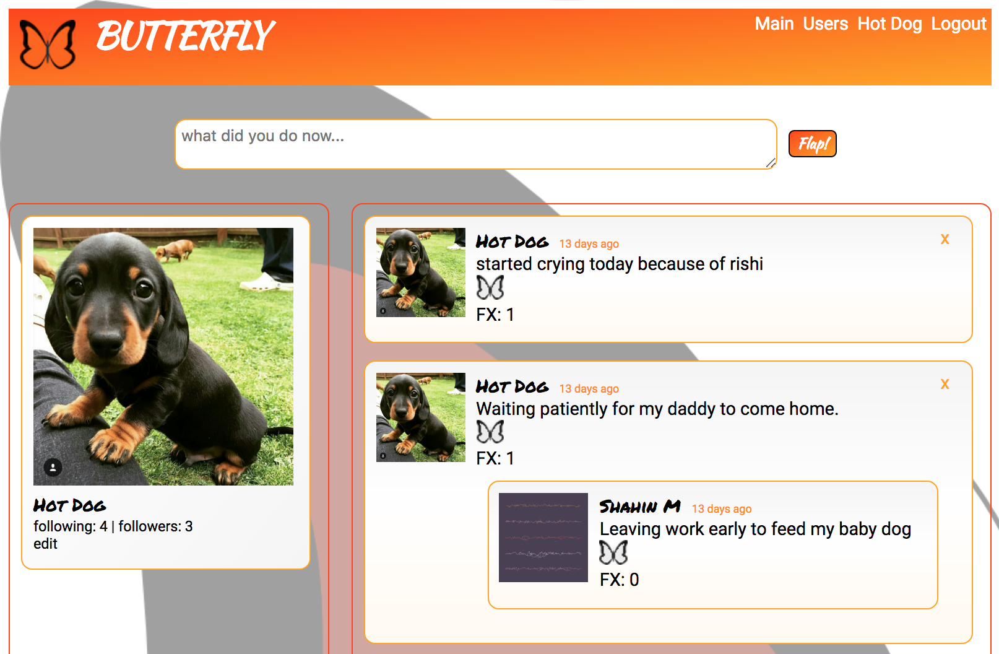
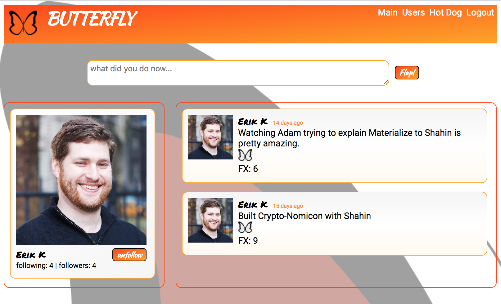
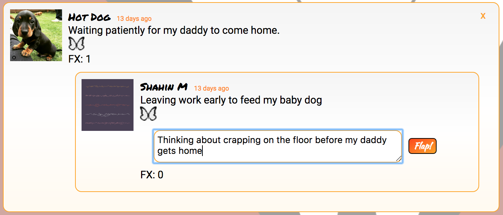

# BUTTERFLY



A social messaging platform that allows you to create status updates, or "flaps", that accumulate effects: status updates caused by your "flap"!  Drop down the "FX" panel to see the butterfly effect your status update had on the world!

Sign up, follow other users, create original flaps, or create flaps in response to other flaps in your feed.  Delete flaps without disrupting the causal chain-- have an insane time!

[Demo](https://youtu.be/na1Eqad0zHw)

  

  

  


## Installing / Getting Started

This project was bootstrapped with [Create React App](https://www.google.com). It also uses [npm](https://www.npmjs.com/) and a [react](https://reactjs.org/) based frontend. The backend uses [Rails 5.1.5](http://weblog.rubyonrails.org/2017/8/24/Rails-5-1-4-rc1-and-5-0-6-rc1-released/) and the [Postgres](https://www.postgresql.org/) database-- see [Butterfly-backend](https://github.com/nspp99b/butterfly-backend) repo for backend details!

### Server setup

Make sure PostgreSQL 10 is running locally.  

Fork and/or clone the [Butterfly-backend](https://github.com/nspp99b/butterfly-backend) repository, navigate to your directory and run:
```
rails db:create
rails db:migrate
```
Then you can spool up the server locally by running `rails s -p 3001` which defaults to serving `http://localhost:3001`.

### Frontend setup

With your backend server running, navigate into your local clone and run:
```
npm install && npm start
```
to get dependencies installed locally and have it running on your local host. If you are running your API server on localhost:3000 you will be asked if you would like to start the client server on a different port. Press Y and enter to allow this. Because it is a Create-React app this will automatically open a browser window pointing to the frontend and you will be able to interact from there.

## License

Copyright 2018 [Shahin Motia](https://github.com/nspp99b)

Permission is hereby granted, free of charge, to any person obtaining a copy of this software and associated documentation files (the "Software"), to deal in the Software without restriction, including without limitation the rights to use, copy, modify, merge, publish, distribute, sublicense, and/or sell copies of the Software, and to permit persons to whom the Software is furnished to do so, subject to the following conditions:

The above copyright notice and this permission notice shall be included in all copies or substantial portions of the Software.

THE SOFTWARE IS PROVIDED "AS IS", WITHOUT WARRANTY OF ANY KIND, EXPRESS OR IMPLIED, INCLUDING BUT NOT LIMITED TO THE WARRANTIES OF MERCHANTABILITY, FITNESS FOR A PARTICULAR PURPOSE AND NONINFRINGEMENT. IN NO EVENT SHALL THE AUTHORS OR COPYRIGHT HOLDERS BE LIABLE FOR ANY CLAIM, DAMAGES OR OTHER LIABILITY, WHETHER IN AN ACTION OF CONTRACT, TORT OR OTHERWISE, ARISING FROM, OUT OF OR IN CONNECTION WITH THE SOFTWARE OR THE USE OR OTHER DEALINGS IN THE SOFTWARE.
